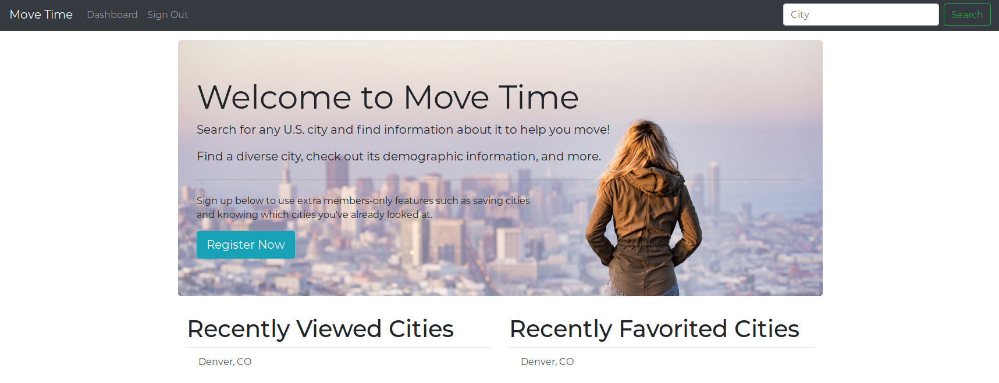
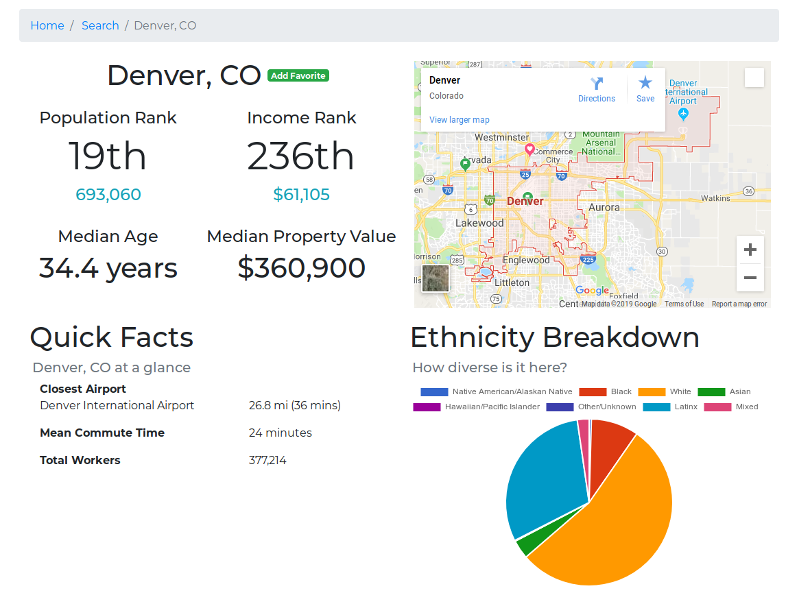
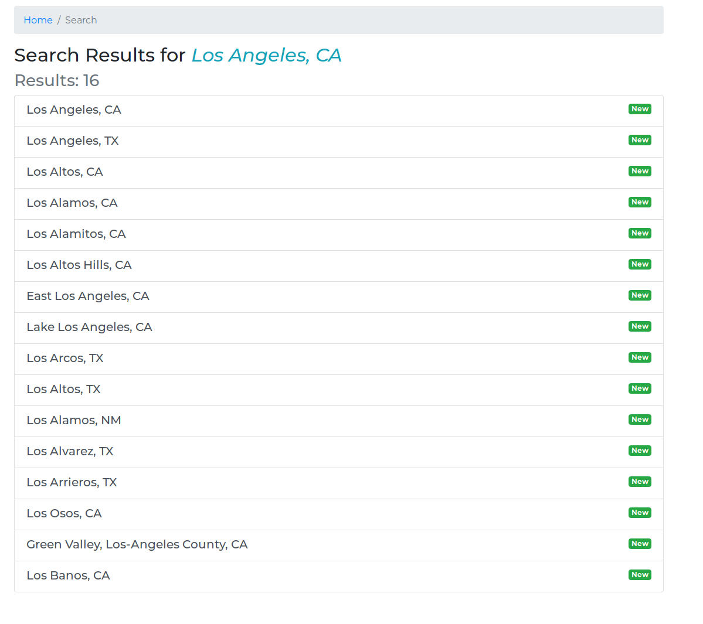

# Move Time

[Live Link](https://move-time.herokuapp.com)

## Table of Contents

* [Description/Purpose](#descriptionpurpose)
* [System Requirements](#system-requirements)
* [Application Requirements](#application-requirements)
* [Installation](#installation)
* [Configuration](#configuration)
* [Testing Suite](#testing-suite)
    * [Running the Test Suite](#running-the-test-suite)
* [Screenshots](#screenshots)
        * [Home Page](#home-page)
        * [City View Page](#city-view-page)
        * [City Search Page](#city-search-page)
* [Contributors/Developers](#contributorsdevelopers)
* [Special Thanks](#special-thanks)

## Description/Purpose

This application is designed to help users find out which cities they may
want to move to. A user can register an account to save cities they want to
come back to later. For now, this application features just basic data on
cities, such as median home prices and ethnicity breakdowns (and more).

## System Requirements

To run this application, the following items must be installed and configured:

* [Ruby >= 2.5.1](https://www.ruby-lang.org/en/) - The language MoveTime is 
written in
* [Rails >= 5.2.1](https://rubyonrails.org/) - The web framework
* [Redis](https://redis.io/) - For caching user requests
* [Bundler](https://bundler.io/) - For installing Ruby gems
* [PostgreSQL](https://www.postgresql.org/) - Database of choice for Move Time

## Application Requirements

This application requires an API key from Google. The API key must be set in
the application's environment variables under the key name `GOOGLE_MAPS_KEY`.

You can get your own Google API key 
[here](https://developers.google.com/maps/documentation/javascript/get-api-key).

More information about where to set this key is located below.

## Installation

1. Clone this repository `git clone git@github.com:mikecm1141/move_time.git`
1. Navigate to project directory `cd move_time`
1. Run `bundle install` to install dependencies
1. Run `figaro install` to generate the `application.yml` file - this is where
your `GOOGLE_MAPS_KEY` should go
1. Run `rails db:{create,migrate}` to create the database and run the database
migrations
1. Run `rails server` to start up the server
1. Application now available at `http://localhost:3000`

## Configuration

This application uses a Redis installation to cache the HTTP requests sent
to the Data USA service. For `development` environments, the application is set
to use a Redis server at `redis://localhost:6379`. For `production`
environments, the application is set to use a Redis server at `ENV['REDIS_URL']`
which should be changed to reflect your production environment.

## Testing Suite

This project is tested using [RSpec](http://rspec.info/) and aims to hit 100%
test coverage at all times.

### Running the Test Suite

1. Navigate to installed project directory `move_time`
1. Run `rspec` to run the full test suite

## Screenshots

#### Home Page

#### City View Page

#### City Search Page

## Contributors/Developers

[Mike McKee](https://github.com/mikecm1141/)

## Special Thanks

Special thank you to the [Data USA API](https://datausa.io/) for helping out
with U.S. Census data endpoints.
